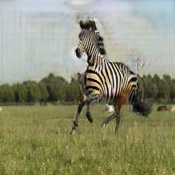
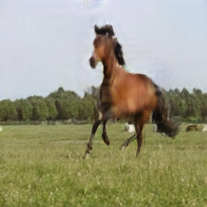
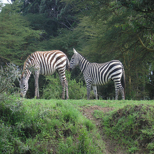
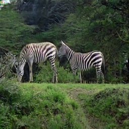

# CycleGAN

## Unpaired Image-to-Image Translation using Cycle-Consistent Adversarial Networks
by Jun-Yan Zhu, Taesung Park, Phillip Isola, Alexei A. Efros

### Abstract
_Image-to-image translation is a class of vision and graphics problems where the goal is to learn the mapping between an input image and an output image using a training set of aligned image pairs. However, for many tasks, paired training data will not be available. We present an approach for learning to translate an image from a source domain X to a target domain Y in the absence of paired examples. Our goal is to learn a mapping G:X→Y such that the distribution of images from G(X) is indistinguishable from the distribution Y using an adversarial loss. Because this mapping is highly under-constrained, we couple it with an inverse mapping F:Y→X and introduce a cycle consistency loss to push F(G(X))≈X (and vice versa). Qualitative results are presented on several tasks where paired training data does not exist, including collection style transfer, object transfiguration, season transfer, photo enhancement, etc. Quantitative comparisons against several prior methods demonstrate the superiority of our approach._

```
@misc{zhu2020unpaired,
      title={Unpaired Image-to-Image Translation using Cycle-Consistent Adversarial Networks}, 
      author={Jun-Yan Zhu and Taesung Park and Phillip Isola and Alexei A. Efros},
      year={2020},
      eprint={1703.10593},
      archivePrefix={arXiv},
      primaryClass={cs.CV}
}
```

## Train/Test

- Download a CycleGAN dataset (e.g. maps):
```bash
bash ./datasets/download_cyclegan_dataset.sh maps
```

- Train a model:
```bash
python train.py
```
To see more intermediate results, check out `./saved_images_CycleGAN/`.
- Test the model:
```bash
python test.py
```

The test results will be saved here: `.datasets/horse2zebra/`.

Or apply a pre-trained model: [Pretrained weights](https://github.com/wcaine/CycleGAN/releases/tag/v1.0).

Extract the zip file and put the `.pth` files in here: `./saved_images_CycleGAN/`. Make sure you put LOAD_MODEL=True in the config.py file.

## Example Results

| Input | Generated | Reconstructed |
| --- | --- | --- |
|  |  |  |
|  |  |  |

## Acknowledgments
Code is inspired by [junyanz](https://github.com/junyanz/pytorch-CycleGAN-and-pix2pix) and [aladdinpersson](https://github.com/aladdinpersson/Machine-Learning-Collection/tree/master/ML/Pytorch/GANs/CycleGAN).